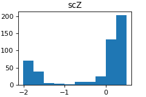
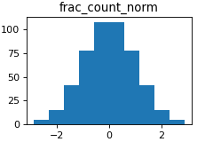
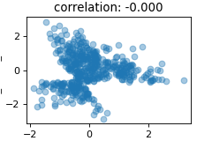
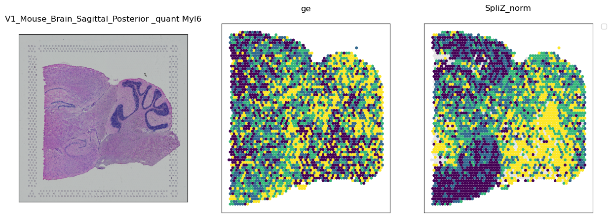

# Visium analysis with the SpliZ / ReadZS

## Step 1: Download data

All the Visium data I've downloaded is here: `/oak/stanford/groups/horence/JuliaO/data/visium/`. I copied the "batch download" commands from https://www.10xgenomics.com/resources/datasets/ and ran them in sherlock (separately for each sample). Key files are:

* `*.tif`: The histology image

### If BAM is available
As in https://www.10xgenomics.com/resources/datasets/mouse-brain-serial-section-2-sagittal-anterior-1-standard-1-1-0; see `/oak/stanford/groups/horence/JuliaO/data/visium/V1_Mouse_Brain_Sagittal_Posterior` for example downloaded data:
* `*possorted_genome_bam.bam`: The BAM file. 
* `spatial/tissue_positions_list.csv`: maps barcodes to spatial locations (described here: https://support.10xgenomics.com/spatial-gene-expression/software/pipelines/latest/output/images). 
* `filtered_feature_bc_matrix/*`: Gives gene expression values to compare against. Should contain `barcodes.tsv.gz`, `features.tsv.gz`, and `matrix.mtx.gz`   

### If BAM is not available

As in https://www.biorxiv.org/content/10.1101/2021.08.03.455000v1.full.pdf; see `/oak/stanford/groups/horence/JuliaO/data/visium/brain_metastases` for example downloaded data:
* `*_L001_R{1,2}_001.fastq.gz`: R1 and R2 fastqs

## Step 2: Run spaceranger to get BAMs and spatial metadata

If the BAM was not available for the download, you need to run spaceranger to get the other required files. Spaceranger is downloaded on sherlock here: `/home/groups/horence/applications/spaceranger-1.3.1/`.

Example call to spaceranger count with input descriptions from https://support.10xgenomics.com/spatial-gene-expression/software/pipelines/latest/using/count#count

```
$ cd /home/jdoe/runs
$ spaceranger count --id=sample345 \ #Output directory
                   --transcriptome=/opt/refdata/GRCh38-2020-A \ #Path to Reference
                   --fastqs=/home/jdoe/runs/HAWT7ADXX/outs/fastq_path \ #Path to FASTQs
                   --sample=mysample \ #Sample name from FASTQ filename
                   --image=/home/jdoe/runs/images/sample345.tiff \ #Path to brightfield image 
                   --slide=V19J01-123 \ #Slide ID
                   --area=A1 \ #Capture area
                   --localcores=8 \ #Allowed cores in localmode
                   --localmem=64 #Allowed memory (GB) in localmode 
```

Example call to spaceranger in this repo: [`run_spaceranger.sh`](scripts/submission_scripts/run_spaceranger.sh)

The Reference was downloaded using this command:

```
curl -O https://cf.10xgenomics.com/supp/spatial-exp/refdata-gex-GRCh38-2020-A.tar.gz
```

The `slide` and `area` values should be available from wherever you downloaded the data. For example, see "visium gene expression slideserial number" in https://www.ncbi.nlm.nih.gov/geo/query/acc.cgi?acc=GSM5420749.

Once you run spaceranger, the required files from [Step 1](#Step-1:-Download-data) should be available in `outs/filtered_feature_bc_matrix/` and `outs/spatial/`.

The 10X team are very helpful with debugging, so if you run into errors definitely email them.

## Step 3: Transform metadata into form required for SpliZ/ReadZS

Use the notebook [`visium_meta_clean.ipynb`](notebooks/visium_meta_clean.ipynb) to create the metadata file. Change the following at the top of the notebook to match your data:
* `dataname`: Name to use when saving the output file
* `cer_loc_name`: Path to the `tissue_positions_list.csv` file discussed in Step 1.
* `im_path`: Path to the tif image
* `filt_bc_name`: path to the filtered gene expression matrix discussed in Step 1.

Then run all the cells.

Note: sometimes I've found the images to be rotated according to what I'd expect. For example, you can see that the pixel map on the left of a brain metastasis slide seems to be mismatched - the image is flipped relative to what we're plotting, so we're extracting the wrong pixel values from the image. You can flip around the blur matrix and transpose it until it matches up with the histology (image on the right). You can also change the `plot_xcoord` and `plot_ycoord` columns to flip the image around so it matches the histology. I haven't found a programmatic way of knowing when this flip is happening.

 

Outputs:
* [`notebooks/output/visium_meta/{dataname}_blur.png`](notebooks/output/visium_meta/V1_Mouse_Brain_Sagittal_Posterior_blur.png): Plot of the histology image blurred to the specified level (default: 70)
* [`notebooks/output/visium_meta/{dataname}_pixquant.png`](notebooks/output/visium_meta/V1_Mouse_Brain_Sagittal_Posterior_pixquant.png): Plot of the pixel values from the blurred image, quantiled
* [`notebooks/output/visium_meta/{dataname}_pixval.png`](notebooks/output/visium_meta/V1_Mouse_Brain_Sagittal_Posterior_pixval.png): Plot of the raw pixel values from the blurred image
* [`notebooks/output/visium_meta/meta_{dataname}.tsv`](notebooks/output/visium_meta/meta_V1_Mouse_Brain_Sagittal_Posterior.tsv): The metadata tsv file

Columns in metadata file (some columns from `tissue_positions_list.csv` directly, see documentation here: https://support.10xgenomics.com/spatial-gene-expression/software/pipelines/latest/output/images):
* `barcode`: Barcode that can be mapped to BAM barcode
* `in_tissue`: 1 if in the tissue, 0 if out. All should be 1 because we're subsetting to only spots in the tissue here.
* `array_row`: The row coordinate of the spot in the array from 0 to 77. The array has 78 rows.
* `array_col`: The column coordinate of the spot in the array. In order to express the orange crate arrangement of the spots, this column index uses even numbers from 0 to 126 for even rows, and odd numbers from 1 to 127 for odd rows. Notice then that each row (even or odd) has 64 spots.
* `xcoord`: The row pixel coordinate of the center of the spot in the full resolution image.
* `ycoord`: The column pixel coordinate of the center of the spot in the full resolution image.
* `cell_id`: `{dataname}_{barcode[:-2]}` (cutting off the `-1` at the end of the barcode; this should match up with names of cells in ReadZS/SpliZ)
* `plot_xcoord`: `ycoord` (use for plotting to align with histology image)
* `plot_ycoord`: `-xcoord` (use for plotting to align with histology image)
* `pixval`: pixel value at the given spot (with blur)
* `pixquant`: pixel quantile at the given spot (with blur; default is 10 quantiles)

## Step 4: Run SpliZ/ReadZS

### ReadZS

Visium data can be run using the main branch of the [ReadZS pipeline](https://github.com/salzmanlab/ReadZS) without modification. An example [config file](nextflow_inputs/visium_readzs.config), [samplesheet](nextflow_inputs/samplesheet_readzs.csv), and [bash script](nextflow_inputs/run_readzs.sh) are provided. 

In the bash script, change `runName` to whatever you want. In the samplesheet, your sample name and its BAM (I haven't run with multiple visium samples with ReadZS, but I suppose that you could). In the config file, include the path to the samplesheet, metadatafile described in Step 3, and other [input files required for ReadZS](https://github.com/salzmanlab/ReadZS#input-arguments). 

Note: It's okay if the ReadZS pipeline doesn't complete, as long as the `CALC_ZSCORES` step finishes.

The ReadZS pipeline creates a separate z score file for each chromosome. It's convenient for us to concatenate them into one file. You can use [the provided bash script](bash_scripts/concat_zscore.sh) to do this, by letting `ZDIR` be the path to the zscore directory from the ReadZS output, and `DATANAME` be your dataname (this determines the name the file will be saved with).

The relevant file is the concatenated file created with this script, `{dataname}.zscore`. This contains one row per spot per 5000-bp window. Relevant columns are:

* `window`: 5000-bp ReadZS window
* `cell_id`: Spot identifier
* `z_scaled`: ReadZS value

### SpliZ

Running the SpliZ pipeline is pretty much the same procedure as running the ReadZS. Visium data can be run using the main branch of the [SpliZ pipeline](https://github.com/salzmanlab/SpliZ) without modification. An example [config file](nextflow_inputs/visium_spliz.config), [samplesheet](nextflow_inputs/samplesheet_spliz.csv), and [bash script](nextflow_inputs/run_spliz.sh) are provided.

Note: It's okay if the SpliZ pipeline doesn't complete, as long as the `CALC_SPLIZVD` step finishes.

The relevant SpliZ output file is `SpliZ_values/*_subcol.tsv`. This file has one row per gene per spot. The relevant columns are:

* `gene`: gene name
* `cell`: spot id
* `scZ`: SpliZ value for that gene in that spot

## Step 5: Make samplesheet

Note that for the remaining code, rather than taking arguments for a bunch of input paths each time, I have all the paths saved in a csv that I access in each script. The access looks something like this: 

```
dataname = "V1_Mouse_Brain_Sagittal_Posterior"
samples = pd.read_csv("notebooks/output/make_samplesheet/spatial.csv",index_col = 0)
row = samples.loc[dataname]

score = "ReadZS"
scores = pd.read_csv("output/make_samplesheet/scores.csv",index_col=0)
srow = scores.loc[score]
```

I found this easier than having to manually copy the paths each time. Also, it's fine if all the metadata paths (for example) don't follow the same format between datasets, because I just have to put the correct path for each one into the samplesheet and then everything works smoothly. I think this is a good approach if there are a lot of datasets/scores you're iterating over, because it forces you to keep an up-to-date spreadsheet of where all the inputs/outputs are, and you can avoid copy/pasting paths. Also, no need to put an entry in every cell; you can just put an empty string if you don't have the given file for the given dataset.

The process of making this samplesheet is a little manual, since you have to write all the correct paths for all of your datasets. But you only have to do this once for each. I make the samplesheet in a [notebook](notebooks/make_samplesheet.ipynb). 
The columns of the output of the [spatial file](notebooks/output/make_samplesheet/spatial.csv) are:
* `dataname`: identifier of data
* `method`: visium or 10x
* `spliz_vals`: path to the `sym_SVD_normdonor_S_0.1_z_0.0_b_5_r_0.01_subcol.tsv` file from the SpliZ pipeline (in `SpliZ_values`)
* `readzs_vals`: path to the concatenated z score file from the [`concat_zscore.sh` script](bash_scripts/concat_zscore.sh)
* `ge_vals`: path to parsed gene expression values (Step 6)
* `tissue`: string identifying the tissue (e.g. "Brain")
* `image`: path to the .tif image
* `metadata`: path to the metadata file (described in Step 3)
* `pixcorr_ge`: path to correlation of pixel value and gene expression (Step 8)
* `pixcorr_readzs`: path to correlation of pixel value and ReadZS (Step 8)
* `pixcorr_spliz`: path to correlation of pixel value and SpliZ (Step 8)
* `readzs_ge`: path to Parsed ReadZS counts (Step 6)
* `resid_spliz`: path to residual after removing gene expression for SpliZ (Step 7)
* `resid_readzs`: path to residual after removing gene expression for ReadZS (Step 7)
* `bam`: path to BAM file
* `tiss_pos_list`: path to `tissue_positions_list.csv` described in step 1
* `ge_mat`: path to the filtered gene expression matrix described in step 1
* `readzs_counts`: path to the raw ReadZS count file (output from the pipeline)

The column outputs of the [scores file](notebooks/output/make_samplesheet/scores.csv) are:
* `name`: name of the score (e.g. `SpliZ`)
* `col`: column in the zscore file that contains this value (e.g. `scZ`)
* `genecol`: either `gene` or `window`
* `cellid`: Name of the cell column (`cell` or `cell_id`)
* `valname`: name of column in `spatial.csv` file that contains zscores

## Step 6: Extract gene expression values for comparison

### By gene (for comparison with the SpliZ)

We want to extract gene expression values for each gene so that we can extricate gene expression patterns from splicing patterns. The script [`parse_gene_expression.py`](scripts/parse_gene_expression.py) parses the gene expression matrix returned by spaceranger into a table that we can use in downstream analysis. The sbatch script [`run_ge.sh`](scripts/submission_scripts/run_ge.sh) submits the job for this step. 

Input parameters:
* `dataname`: Data name in the dataset samplesheet (Step 5)
* `thresh`: Require more than `thresh` spots to have nonzero values for the gene for it to be reported.
* `genes`: Genes to parse gene expression for. If blank, all will be parsed.
* `norm`: Including the `--norm` tag returns values normalized by count in each cell. Otherwise values are just integer counts

Outputs (one row per gene, spot pair):
* `{dataname}.tsv`: table with all gene counts per cell and metadata
* `{dataname}.pq`: parquet form of table
* `{dataname}_sub_{thresh}.tsv`: table with gene counts per cell if the gene has a nonzero value in `> thresh` spots
* `{dataname}_sub_{thresh}.pq`: parquet form of table

Output columns not defined in the metadata:
* `gene`: gene name
* `ensembl`: ensembl id
* `frac_count`: if norm: the number of counts mapping to this window in this spot, divided by the number of counts mapping to this spot; if not norm, just the number of counts mapping to this window in this spot.

### By window (for comparison with the ReadZS)

We want to extract gene expression values for each window so that we can compare with ReadZS patterns. The script [`readzs_ge.py`](scripts/readzs_ge.py) parses the count values from the ReadZS output for each window and turns them into a table we can use for downstream analysis. The sbatch script [`run_ge_readzs.sh`](scripts/submission_scripts/run_ge_readzs.sh) submits the job for this step.

Input parameters:
* `dataname`: Data name in the dataset samplesheet (Step 5)
* `thresh`: Only report windows with expression in > `thresh` spots

Output (one row per window, spot pair):
* `{dataname}_readzs_ge_{thresh}.tsv`: table with all window counts per spot and metadata
* `{dataname}_readzs_ge_{thresh}.pq`: parquet version of the table

Output columns not defined in metadata:
* `cell_id`: spot identification column
* `chr`: chromosome
* `pos`: position on chromosome
* `strand`: strand on chromosome
* `sample`: `dataname`
* `window`: window identifier
* `window_count`: The number of reads for the given window for the given cell
* `cell_count`: The number of reads across all windows for the given spot
* `frac_count`: `window_count` / `cell_count`

## Step 7: Normalize data

If we're interested in SpliZ/ReadZS patterns that are independent of gene expression, it can be helpful to "regress out" gene expression information to get scores with no ability to predict gene expression. We compute the residuals as follows:

1. Normalize both SpliZ (or ReadZS) values and gene expression values so they are on the same scale
2. Perform a linear regression to predict SpliZ (or ReadZS) value based on the gene expression value
3. Subtract the predicted value from the observed value to get the "residual": the variation in the SpliZ unexplained by gene expression

We can create this "normalized" version of the SpliZ, ReadZS, or gene expression scores by doing the following for each gene/window: 

1. Rank all values from smallest to largest (ties are broken randomly, so the same value can get multiple ranks)
2. Assign each rank to a uniform value between 0 and 1 (the value will be $\frac{r}{R + 1}$ where $r$ is the rank in question and $R$ is the max rank of the dataset)
3. Use the reverse normal cdf to map each of these values to values from the normal distribution.

Normalization is important because the gene expression and SpliZ/ReadZS values can be on different scales, and can be skewed. For example, for the gene _Gng13_ the SpliZ and gene counts histograms are skewed before normalization:

  

After normalization, we can see that these irregularities go away:

  

We can look at the plots of SpliZ vs gene expression, and compare to normalized SpliZ vs. normalized gene expression:

  

Now here is the histogram for the residuals (after regressing out gene expression) and the plot of the SpliZ residual vs gene expression (you can see now the correlation between the two is zero):

  


The script that does all of this is [`save_residuals.py`](scripts/save_residuals.py). The script to submit the job is [`run_res.sh`](scripts/submission_scripts/run_res.sh).

Input parameters:
* `dataname`: Name to use when saving the output file
* `score`: The score you're interested in (`SpliZ` or `ReadZS`)
* `score2`: What you'll regress out of `score` (`ge` or `ReadZS_ge`)
* `outname`: path to save output
* `thresh`: Require > this many spots for the score to keep the given gene/window

Output:
* `{dataname}_{score}_{score2}_{thresh}.tsv`: One row per gene/spot pair

Output columns not yet defined:
* `res`: residual score after regressing `score2` out of `score`
* `{score}_norm`: normalized version of `score`
* `{score2}_norm`: normalized version of `score2`

## Step 8: Identify spatial patterns

### Pixel correlation

One method of determining spatial regulation is to extract the information from the histology image and correlate that with SpliZ/ReadZS values. Specifically, we can extract the pixel value at each spot in the image (as described in step 3) and correlate pixel value with SpliZ/ReadZS value. We can also take this correlation with any function of the pixel value, such as the quantiled value. Nuclei are stained in the histology image, so there is some biological interpretability of the results.

The script that performs this correlation is [pixel_correlation.py](scripts/pixel_correlation.py), and it can be submitted with [run_corr.sh](scripts/submission_scripts/run_corr.sh). 

Input parameters:
* `dataname`: Name to use when saving the output file
* `thresh`: Only perform correlation for gene/window with non-NA values in > `thresh` spots
* `score`: The score you're interested in correlating with the pixel value (e.g. `SpliZ` or `ReadZS`)
* `outpath`: path to save output

Output:
* `{dataname}_{score}_{thresh}.tsv`: One row per gene/window

Output columns not previously defined:
* `num_spots`: Number of spots with non-NA values for this gene/window
* `corr_pixval`: Spearman correlation of `score` with pixel value
* `pval_pixval`: Spearman p value of `score` with pixel value
* `corr_pixquant`: Spearman correlation of `score` with pixel quantile
* `pval_pixquant`: Spearman p value of `score` with pixel quantile
* `pval_pixval_adj`: Benjamini-Hochberg-corrected pixel value correlation p value
* `pval_pixquant_adj`: Benjamini-Hochberg-corrected pixel quantile correlation p value

### Ising metric

Another method of finding spatial patterns is inspired by the Ising model of magnetism. The test is performed separately for each gene. 

Let's define a graph $G$ on the visium spots with non-NA values for the given gene. Let the vertices of $G$ be the visium spots ($V = {1, ..., n}$) and edges $E$ be pairs of spots that are next to each other (note that we can define this graph structure aany way we want; we could allow a larger radius of spots to be considered "neighbors" by setting the `radius` variable in the script to be larger). Let $s_i$ be the score (e.g. SpliZ or ReadZS) of spot $i$. Then the Ising score $I$ is defined as follows:

$$ I = \frac{\sum_{(i,j) \in E}s_is_j}{|E|}. $$

Note that if the scores are centered around 0 (which they are for the SpliZ and ReadZS), then under the null hypothesis that the arrangement of the scores isn't spatially determined, $\mathbb{E}(I) = 0$. We can also do this for gene expression by using the normalized gene expression value described in Step 7). The larger $I$ is, the more likely it is that spots with the same score are close together. If the score is less than zero, it indicates a "reverse magnetism" between spots with similar scores.

[The traditional Ising model](https://www.stat.berkeley.edu/~mossel/teach/206af06/scribes/aug29.pdf) is discrete, with spots taking values of +1 or -1. Based on the configuration of spins, you can solve for the magnetism of the system (an indication of how "ordered" the system is). [Continuous-spin Ising models were introduced in 1969](https://aip.scitation.org/doi/abs/10.1063/1.1665005?journalCode=jmp). However, the theory to calculate the magnestism of the continuous system isn't straightforward. Also, a system would have high magnetism even if almost all the spots were the same, which isn't a configuration we're interested in. The Ising model [has been applied to biological problems before](https://www.sciencedirect.com/science/article/pii/S0002929707611409?via%3Dihub#bib4).

Instead, to get p values I used permutations. At first, I just permuted which scores were assigned to which spot for the given genes, and found how "extreme" the score we observed was compared to the permuted scores. Let the permuted Ising scores be $I_1, \ldots, I_P$. Then the permutation p value is:

$$\frac{\sum_{i=1}^P \mathbb{I}(I_i > I)}{P}.$$ 

But this method wasn't the best null for the empirical data. I switched to a null where, for one permutation for a given gene, for each neighboring pair of spots with non-NA values for that gene, I randomly chose a gene for which both of those spots were non-null, and multiplied their scores.

The script that calculates these Ising values is [ising.py](scripts/ising.py). It can be submitted using [run_ising.sh](scripts/submission_scripts/run_ising.sh). 

This takes a while for the ReadZS (it's not very well optimized). For that, I use a threshold of 1000 (compared to 100 for SpliZ) and I run separately for each score with a 48-hour time limit.

Input parameters:
* `dataname`: Name to use when saving the output file
* `score`: The score you're interested in finding spatial patterns in (e.g. `SpliZ` or `ReadZS`)
* `thresh`: Require > `thresh` spots to have non-NA values for `score`
* `num_perms`: Number of permutations to perform

Output:
* `{dataname}_{score}_{thresh}_{num_perms}.tsv`: one row per gene/window

Output columns not previously defined:
* `score_cont`: Ising score for the gene/window
* `num_pairs`: Number of spots neighboring each other with non-NA values for the gene/window
* `perm_pval`: P value from permutations
* `perm_pvals_adj`: P value from permutations adjusted with Benjamini-Hochberg
* `mean_score`: The mean value of `score` for this gene/window


## Step 8: Plot genes of interest

### Plot two scores and tissue

Once genes with significant spatial patterns for a score are determined, the next step is to visualize those patterns. To create a plot with the histology image, score1 values mapped to spot locations, and score2 values mapped to spot locations, you can use [plot_gene_val.py](scripts/plot_gene_val.py). It can be submitted using [run_spat_plot.sh](scripts/submission_scripts/run_spat_plot.sh). Example plot:



Input parameters:
* `dataname`: Name to use when saving the output file/identifying data to plot
* `score`: first score to plot (must be in: "ge","SpliZ","ReadZS","ReadZS_ge", "ReadZS_resid","ReadZS_norm","SpliZ_resid","SpliZ_norm","ReadZS_ge_norm","ge_norm")
* `score2`: second score to plot (must be in: "ge","SpliZ","ReadZS","ReadZS_ge", "ReadZS_resid","ReadZS_norm","SpliZ_resid","SpliZ_norm","ReadZS_ge_norm","ge_norm")
* `window_file`: file with no header, window on each line, saying which genes/windows to plot. It is pre-created for significant genes by the ising script (`*_plot.txt`).

Output:
* `{dataname}_{gene}_{score}_{score2}.png`: plot with three panels
* `{dataname}_{gene}_{score}_{score2}_quant.png`: plot with three panels where the scores are quantiled (4 quantiles)

### Peak plots
This creates ReadZS-style peak plots for each window in a file. Cells are divided up by ReadZS quantiles, and then peaks are plotted. The `window_file` described above can be used as input. Specify the dataname, and make sure the path to the file is specified. Plotting can be run with the [run_plotterfile.sh](scripts/submission_scripts/run_spat_plot.sh) file, specifiying the following parameters:

Input parameters:
* `DATANAME`: Name to use when saving plots/accessing data
* `GFF`: gff file for the organism being analyzed
* `WINDOWFILE`: file with one window per line and no header. These are the windows that will be plotted


## Useful commands

To copy over Table 2: `scp jolivier@login.sherlock.stanford.edu:/oak/stanford/groups/horence/JuliaO/visium_analysis/notebooks/output/make_tables/spatial_table2.tsv .`
To concatenate plot files into one: `cat V1*SpliZ_norm*b0_plot.txt | sort | uniq -u > joint_genes.txt`

## Notebooks/scripts used for paper analysis

* `make_overview_table.ipynb`: used to make table 1
* `make_tables.ipynb`: used to make table 2
* `analyze_ising.ipynb`: make correlation plots
## References

<a id="1">[1]</a> 
Meyer E, Dehghannasiri R, Chaung K, Salzman J. (2021).
[ReadZS detects developmentally regulated RNA processing programs in single cell RNA-seq and defines subpopulations independent of gene expression.](https://www.biorxiv.org/content/10.1101/2021.09.29.462469v1.abstract)
bioRxiv.
https://doi.org/10.1101/2021.09.29.462469 

<a id="2">[2]</a> 
Olivieri JE, Dehghannasiri R, Salzman J. (2022)
[The SpliZ generalizes ‘Percent Spliced In’to reveal regulated splicing at single-cell resolution.](https://www.nature.com/articles/s41592-022-01400-x)
Nature Methods. 19(3):307-10.
https://doi.org/10.1038/s41592-022-01400-x

